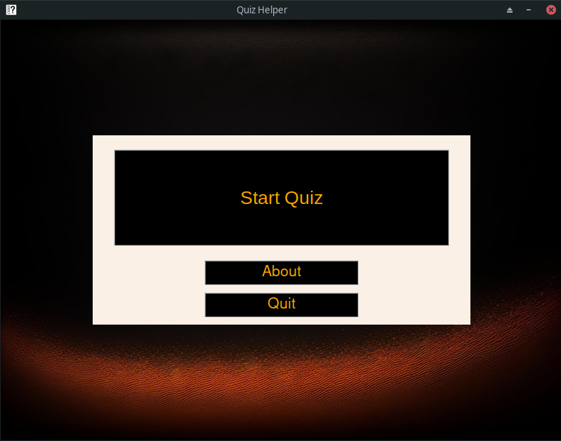
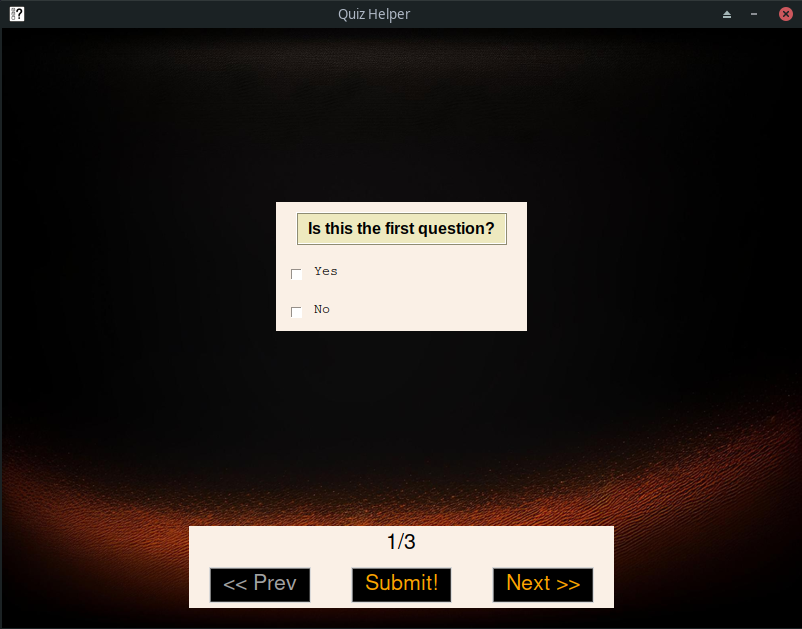
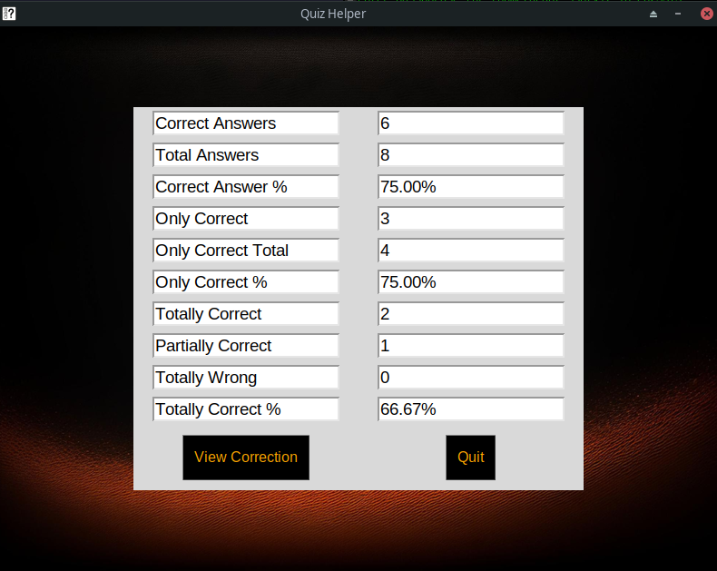
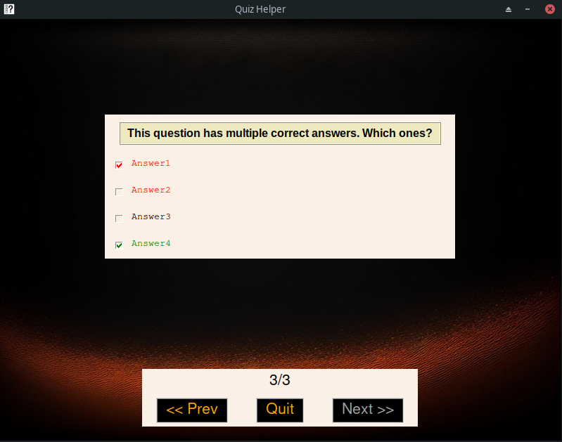

# Quiz-Helper

Create all the quiz you want to test your knowledge in a straightforward
manner with the aid of **Quiz-Helper**. This tool can help review your current
expertise in a topic. The tool of choice if you need to prepare for an exam or
a certification. Quickly create your own knowledge base, an be in control of
your own assessment. You can also create fun quizzes for your friend with an
immediate interface and ready-to-go setup.

## How it looks
Main Page/Results Overview | Question/Review
--- | ---
 | 
 | 

## Getting started
To run this project you have to clone or download this repository, with the command:
```bash
git clone https://github.com/A-725-K/DeCempions
```
Then you have to install the `Python3` libraries using the requirements file:
```bash
python3 -m pip install -r requirements.txt
```
Finally, you can start the program by just running:
```bash
python3 main.py
```

## Explaining .qz input format
The `qz` format has taken inspiration from `csv`, with few differences. Every
line represent a question of the quiz, and each question has a label (or belongs
to a category). Fields in an entry are comma-separated. The only exception is
the answers field which is, in turn, colon-separated. Remember to wrap the text
of the question between double quotes (`"`), as well as the whole "answer" field
if the happen to contain a comma in the text. Prefix each correct answer with an
at symbol (`@`). You can provide up to 7 answers, and **at least one** should be
correct. The lines starting with a pound sign (#) are ignored and not displayed
in the quiz session. The file can contains empty lines.

Example:
```csv
label1,Is this the first question?,@Yes:No
#label1.5,This question is not included in the quiz,Why?:Is ingnored:Because of the #:At the beginning of the line.
label2,"Is this the first question, isn't it?","Yes, of course:@No, what are you saying?#!"

label3,This question has multiple correct answers. Which ones?
```

## Author

* ***Andrea Canepa*** - 2023
